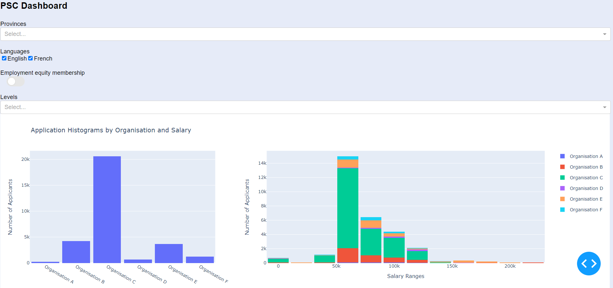

# PSC-dashboard

An interactive HR dashboard developed in Python that provides employee information such as number of applicants per organization, salary ranges etc. to go over and refer to quickly in the form of graphs and with the ability to export such information in a cvs format as needed.

## About the project

## Run the demo
1. Clone this demo from GitHub
2. Run the program in python 
3. Open html file

# Built with 
* [Python](https://www.python.org/)
* [Dash.Plotly](https://dash.plotly.com/)
  
## Source code
[PSC - Data and metadata file](https://github.com/sebandric/PSC-dashboard/tree/main/Data)
